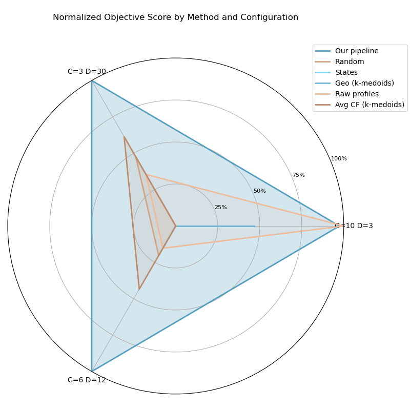

 

📚 [MIT Theses Archive (DSpace@MIT)](https://dspace.mit.edu/handle/1721.1/7582)

# GridCluster: Task-Aware Spatial and Temporal Aggregation for Capacity Expansion Planning

📍 By [Gabriel Duguey](mailto:gduguey@mit.edu)  
Master of Engineering in Data Science for Engineering Systems  
Massachusetts Institute of Technology, 2025

---

This repository contains the code and data for my MIT M.Eng thesis on **designing spatial and temporal aggregation that preserves planning-relevant patterns in power-system Capacity Expansion Planning (CEP)**. The work proposes a composite, feature-based similarity metric for spatial clustering (k-medoids) and representative-day temporal reduction, then evaluates investment plans after re-projecting them to full resolution. New England is used as the case study. This code accompanies the thesis, *Task-Aware Spatial and Temporal Aggregation for Capacity Expansion Planning* (MIT CEE, 2025).&#x20;

## 1) Project overview

* **Goal.** Make CEP models tractable **without** throwing away the patterns that drive siting, transmission, and storage decisions.
* **Idea.** Aggregate **with purpose**: build spatial zones using planning-relevant features (e.g., demand shape, renewable co-variation, ramping) and compress time with representative days that preserve cross-zone interactions.

## 2) Repository structure

```
GridCluster/
├── DATA/                # Data manifest + downloader script
│   ├── data_manifest.csv
│   ├── get_data.py
│   └── README.md
├── demo/                # Example Jupyter notebooks
│   ├── 01_aggregation_pipeline_demo.ipynb
│   └── 02_gtep_model_demo.ipynb
├── docs/                # Figures and thesis draft
│   ├── figs/
│   └── Duguey_gduguey_MEng_cee_2025_thesis.pdf
├── experiments/         # Scripts for running feature, Pareto, and benchmark experiments
│   ├── exp01_features/
│   ├── exp02_pareto/
│   └── exp03_benchmarks/
├── notebooks/           # Notebooks used for plotting some results
│   ├── pareto.ipynb
│   └── weights.ipynb
└── results/             # Outputs of the aggregation pipeline
│   ├── distance_metrics/
│   └── joint_aggregation_results/
├── src/                     # Core implementation
│   ├── README.md
│   ├── aggregation/         # Spatiotemporal aggregation pipeline
│   │   ├── models.py
│   │   ├── pipeline.py
│   │   ├── settings.py
│   │   ├── utils.py
│   │   └── README.md
│   └── gtep/                # Generation & Transmission Expansion Planning (GTEP) model
│       ├── models.py
│       ├── pipeline.py
│       ├── types.py
│       ├── utils.py
│       └── README.md
├── environment.yml          # Conda environment file
├── requirements.txt         # pip requirements
├── LICENSE.txt
└── README.md                # Project overview (this file)
```

## 3) Installation

⚠️ **Note**: This project uses [Gurobi Optimizer](https://www.gurobi.com/) for solving optimization problems. Only the **GTEP module** (`src.gtep`) requires Gurobi. The **aggregation pipeline** (`src.aggregation`) runs without it.

Gurobi is proprietary software and you must have a valid license installed on your system. (Free academic licenses are available for students and researchers.)

---

1. **Clone the repository:**
```bash
git clone https://github.com/gduguey/GridCluster
cd GridCluster
````

2. **Option A — pip (recommended)**

```bash
python -m venv .venv
# Windows
.venv\Scripts\activate
# macOS/Linux
source .venv/bin/activate

pip install -r requirements.txt
```

2. **Option B — Conda**

```bash
# Creates an environment if environment.yml is provided
conda env create -f environment.yml
conda activate gridcluster
```

## 4) Data setup

Raw data are provided as a single archive hosted on Google Drive. You **don’t** need to find the link manually: a tiny manifest tells the downloader exactly what to fetch and how to verify it.

**Download in one command**

```bash
python DATA/get_data.py
```

**What’s in the data (high-level)**

* **3k-bus network (ISONE)** — topology CSVs + **wind/solar capacity factors** (hourly, multi-year).
* **67-county network (New England counties)** — **wind/solar CFs and hourly demand** (historic + future CFs), plus simple node/line CSVs.
* **17-zone network** — compact toy network (no time series).
* **Population & shapes** — Census TIGER/Line shapefiles and derived New England population CSV.

After a successful run, your `DATA/` folder will look like:

```
DATA/
  raw/                # unpacked inputs (see DATA/README.md for details)
  raw.zip             # cached archive (hash-verified)
  data_manifest.csv   # tells the downloader what to fetch/verify
  get_data.py         # the downloader
  README.md
```

## 5) Usage

For hands-on examples, start with the demo notebooks:
* **Aggregation pipeline demo** → [`01_aggregation_pipeline_demo.ipynb`](/demo/01_aggregation_pipeline_demo.ipynb)
* **GTEP model demo** → [`02_gtep_model_demo.ipynb`](/demo/02_gtep_model_demo.ipynb)

The overall workflow is divided into two main modules (both under `src/`) as explained in [Source Code Layout README](src/README.md):
* **Aggregation (`src/aggregation/`)**: reduces spatial and temporal complexity of raw input data.
* **GTEP (`src/gtep/`)**: runs the generation & transmission expansion optimization on aggregated inputs and evaluates the results by mapping then back to the full resolution.

Each submodule has its own README with more detailed explanations:

* [Aggregation README](src/aggregation/README.md)
* [GTEP README](src/gtep/README.md)

## 6) Results / examples

At a glance, the method consistently beats common baselines (political boundaries, pure geographic clustering, or “capacity-factor-only” stats), with the best configuration **reducing de-aggregated system cost by \~13%** vs. heuristics on the New England case study.&#x20;



> For full details and figures (e.g., Pareto frontiers, feature ablations, and normalized score plots akin to Fig. 6.8), see the thesis.&#x20;

## 7) Citation and contact

If you use this code or ideas in your work, please cite:

> Duguey, G. (2025). *Task-Aware Spatial and Temporal Aggregation for Capacity Expansion Planning*. Master’s thesis, MIT Department of Civil and Environmental Engineering.&#x20;

---

### Acknowledgments

This work was developed as part of my thesis under the supervision of [Prof. Saurabh Amin](https://cee.mit.edu/people_individual/saurabh-amin/). I thank Aron Brenner for his crucial help with design, CEP implementation, and experimentation, and Rahman Khorramfar for his ongoing guidance.

---

### Contact

For questions, ideas, or collaborations:
**Gabriel Duguey** – [gduguey@mit.edu](mailto:gduguey@mit.edu)